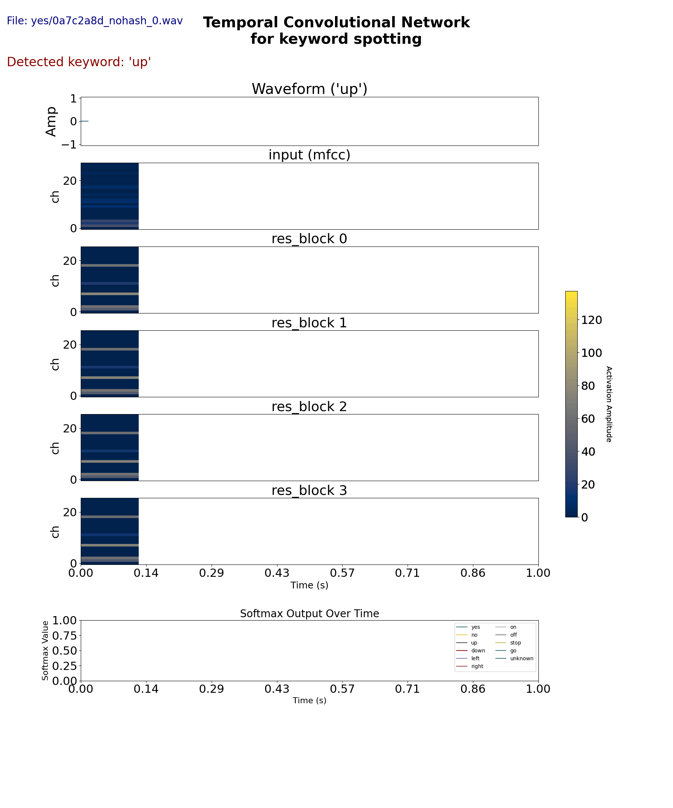

-

	

harken is a hobby project to implement and study temporal convolutional networks in pytorch for keyword spotting and integrate analog hardware system modeling elements for inference,
to keep track of high level metrics such as latency and power consumption.

Training is done in digital domain entirely. The analog hardware model is only intended for inference.

Specific points of interest:
- Limits of quantization of weights and activations for extreme low reslution compute systems.
- Effects of noise, non-linearity and error in analog implementation
- Modeling high level HW system benchmarks such as latency, speed and power consumption. 

Project tree
├── README.md               # Project overview and instructions
├── requirements.txt        # Python dependencies
├── data/
│   └── download_gsc.py     # Script to download Google Speech Commands v2
├── features/
│   └── extract_mfcc.py     # MFCC feature extraction
├── model/
│   ├── tcn.py              # TCN model implementation using NumPy
│   └── layers.py           # Conv1D, ReLU, etc.
├── train/
│   ├── train.py            # Training loop and evaluation
│   └── utils.py            # Utility functions (e.g. accuracy, loss)
├── inference/
│   └── run_inference.py    # Script for running inference on new audio
├── tests/
│   └── test_layers.py      # Unit tests for model components
└── venv/                   # Virtual environment (not pushed to GitHub)

  

